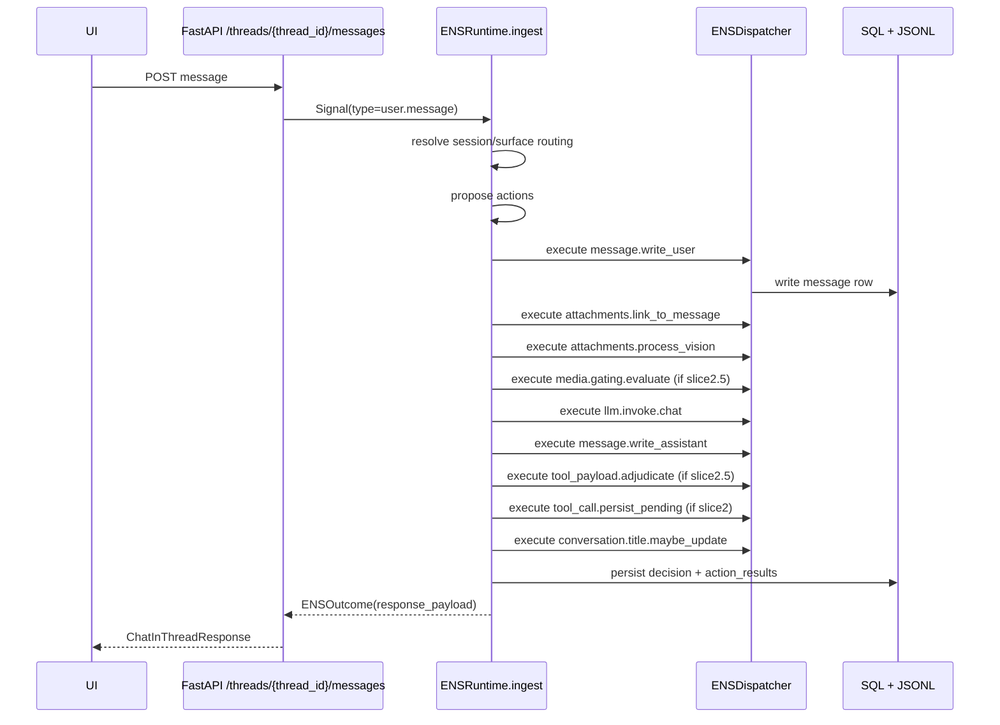
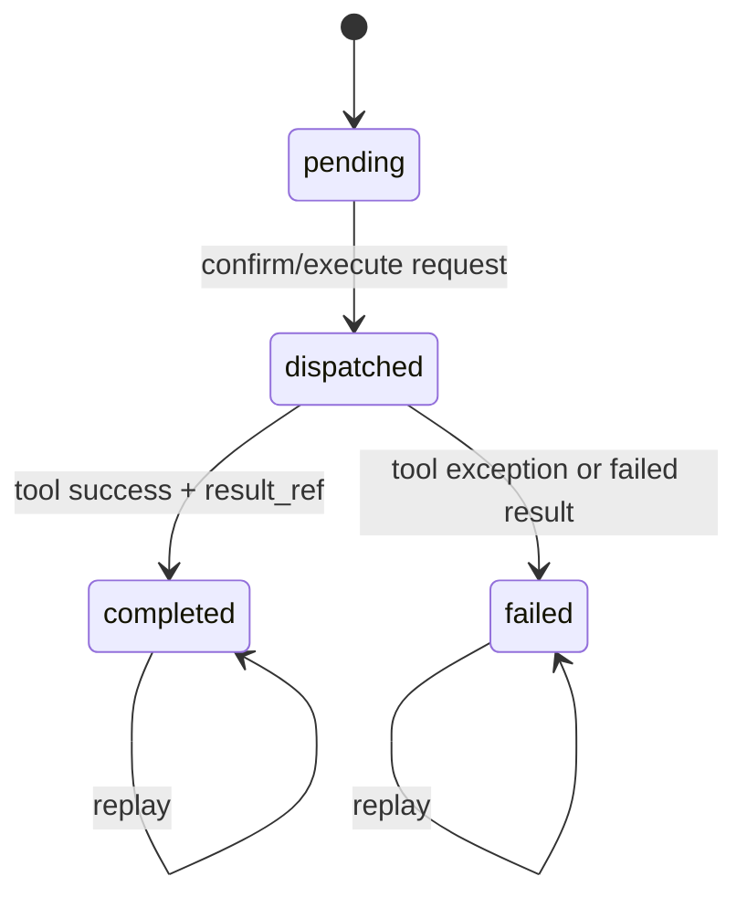

# ENS v2 Overview (Slices 0-7.5)

## What ENS Is

ENS (Executive Nervous System) is the engine's centralized coordination layer for request intake, action planning, idempotent execution, and observability.

In code, the center of gravity is:

- `chorus_engine/ens/models.py` (`Signal`, `ENSAction`, `ENSOutcome`)
- `chorus_engine/ens/runtime.py` (`ENSRuntime.ingest`)
- `chorus_engine/ens/dispatcher.py` (action execution)
- `chorus_engine/ens/decision_store.py` (SQL + JSONL persistence)

ENS is responsible for turning incoming events into a deterministic decision + action trail, with replay-safe behavior where keys are defined.

## What ENS Is Not

ENS is not a complete policy engine yet, and it is not "all features always-on" by default.

Current non-goals/limits in shipped code:

- Streaming generation is still mostly legacy; ENS streaming is intake-only unless other flags are enabled (`ens.streaming_intake_only`, `ens.slice7_unified_llm_invocation`) in `chorus_engine/config/models.py:529`.
- Relationship routing is scaffolded only. `relationship_hint` is stored/audited, but full relationship-aware targeting is not implemented.
- `/api/llm/switch-model` is still integrated-provider/file-path oriented (`model_path`), not a general provider-model-id switch endpoint (`chorus_engine/api/model_routes.py:633`).

---

## Core Concepts

### 1) Signals (`Signal`)

Every ENS flow starts as a normalized signal envelope:

- `type`, `scope`, `source`, `payload`
- routing/correlation fields (`surface_id`, `external_thread_id`, `speaker_external_id`, etc.)
- `signal_id`, `trace_id`, `timestamp`

Defined in `chorus_engine/ens/models.py:13`.

Examples of signal types currently in runtime planning (`chorus_engine/ens/runtime.py`):

- `user.message`
- `external.history.message`
- `scene_capture.preview_requested`
- `tool.execute_requested`
- `surface.send_message_requested`
- `llm.control.requested`
- `config.*.change_requested`

### 2) Decisions

A decision is one ingest cycle's plan record.

Persisted as `ENSDecision` rows (`ens_decisions`) and JSONL entries:

- SQL model: `chorus_engine/models/ens.py:39`
- persistence: `chorus_engine/ens/decision_store.py:20`

Decision payload contains planned actions, arbitration, and explanatory metadata.

### 3) Actions and Action Results

Planned actions are `ENSAction` objects (`kind`, `params`, optional `idempotency_key`) from `chorus_engine/ens/models.py:34`.

Execution happens in dispatcher handlers (`chorus_engine/ens/dispatcher.py`), and each action produces one action result row/json record (`ENSActionResult`).

Status values in practice:

- `success`
- `skipped`
- `failure`

### 4) Idempotency and Replay

ENS action execution checks prior successful results by `idempotency_key` before executing (`chorus_engine/ens/dispatcher.py`).

Replay behavior:

- reused output is returned as `status=skipped` with replay metric
- destructive domains use stable keys (conversation delete, soft delete, outbox intent, tool execution, etc.)
- assistant write idempotency is turn-anchored (session + user_message_id)

### 5) Ownership Flags

Flags are under `ens` config in `SystemConfig` (`chorus_engine/config/models.py:520`).

Key flags and meaning today:

- `enabled`: master ENS routing switch.
- `slice1_chat_ownership`: non-stream `/threads/{thread_id}/messages` core chat ownership.
- `nonstream_intake_only`: non-stream observability-only mode.
- `streaming_intake_only`: streaming intake-only mode.
- `slice2_tool_parsing_ownership`: ENS tool payload parsing/pending persistence path.
- `slice2_tool_dispatch_ownership`: ENS tool execute path for media.
- `slice2_scene_capture_ownership`: ENS-owned scene capture preview/confirm.
- `slice25_media_gating_ownership`: ENS media gating + adjudication.
- `slice3_continuity_writes_ownership`: ENS continuity/memory/summaries/pins writes.
- `slice4_config_ownership`: ENS config/control-plane write ownership.
- `slice6_surface_routing_ownership`: ENS surface binding resolver ownership.
- `slice65_egress_outbox_ownership`: ENS outbox intent ownership.
- `slice7_unified_llm_invocation`: unified LLM invocation ownership.
- `slice75_llm_control_plane_ownership`: unified control-plane ownership.

### 6) ENS-Owned-First Mutation Philosophy

If a feature mutates continuity-relevant state, writes config, invokes LLMs for production behavior, controls model engine state, or emits cross-surface egress, it should route via ENS signal -> decision -> action path.

---

## Life of a Message (Non-Stream)

Endpoint entrypoint:

- `POST /threads/{thread_id}/messages` at `chorus_engine/api/app.py:6218`
- ENS adapter method `_ens_thread_chat` at `chorus_engine/api/app.py:4027`

---

## Tooling in ENS

Tool-related persistence model:

- `ENSToolCallRequest` at `chorus_engine/models/ens.py:79`

Relevant execution path:

- planning in runtime (`tool_payload.adjudicate`, `tool_call.persist_pending`): `chorus_engine/ens/runtime.py`
- pending persistence: `chorus_engine/ens/dispatcher.py:1139`
- execution: `tool.execute_media` -> `_execute_tool_via_app_executor` -> `_ens_execute_tool_call`:
  - `chorus_engine/ens/dispatcher.py:1204`
  - `chorus_engine/api/app.py:4644`

Scene capture uses a synthetic tool contract:

- preview signal `scene_capture.preview_requested`
- preview action `scene_capture.prompt_generate`
- persisted pending tool `tool_name=scene_capture.generate`
- confirm endpoint executes via `tool.execute_requested`

Tool call state model in code:

---

## Media Gating Placement (Slice 2.5)

Flow position in a chat turn:

- after user write, before assistant write finalization
- actions:
  - `media.gating.evaluate`
  - `llm.invoke.chat`
  - `tool_payload.adjudicate`
  - `tool_call.persist_pending`

Planning and idempotency setup is in `chorus_engine/ens/runtime.py` (user-message action planning section).

This is where request type/cooldown/policy snapshot and tool payload admissibility are applied before pending tool calls are persisted.

---

## Vision Flow in ENS Terms

Vision attachment flow is ENS-owned in slice chat path:

- `attachments.link_to_message`
- `attachments.process_vision`

Implemented in dispatcher:

- link: `chorus_engine/ens/dispatcher.py` (`_link_attachments_to_message`)
- process: `chorus_engine/ens/dispatcher.py` (`_process_vision_attachments`)

This processes uploaded image attachments, marks processed metadata, and can emit explicit vision memories via ENS-owned paths.

---

## Surface Routing and Bindings (Slice 6)

Normalized routing is handled by:

- `SurfaceRouter` in `chorus_engine/ens/surface_router.py`
- canonical identity in `chorus_engine/ens/surface_identity.py`
- durable mapping table `surface_bindings` model in `chorus_engine/models/ens.py:100`
- create-with-retry conflict-safe insert in `chorus_engine/repositories/surface_binding_repository.py`

Important current behavior:

- `target_hint=general_chat` is accepted.
- non-`general_chat` hints are ignored but recorded (`ignored_target_hint`).

---

## Egress Outbox (Slice 6.5)

Signal:

- `surface.send_message_requested`

Action:

- `surface.egress.persist_intent`

Persistence:

- table `surface_egress_intents` (`chorus_engine/models/ens.py:129`)
- repository semantics in `chorus_engine/repositories/surface_egress_intent_repository.py`

Endpoints:

- list: `/egress/intents` (`chorus_engine/api/app.py:12580`)
- ack: `/egress/intents/{intent_id}/ack` (`chorus_engine/api/app.py:12617`)
- fail: `/egress/intents/{intent_id}/fail` (`chorus_engine/api/app.py:12636`)
- debug create: `/debug/egress/send-intent` (`chorus_engine/api/app.py:12655`)

Web synchronous chat path intentionally does not emit outbox intents in this slice.

---

## LLM Invocation (Slice 7) vs Control Plane (Slice 7.5)

### Slice 7: Text/vision generation calls

Service:

- `LLMInvocationService` in `chorus_engine/ens/llm_invocation_service.py`

Key points:

- provider-agnostic result shape (`provider=local`, `engine`, optional token/cost)
- stable `request_fingerprint` excludes non-deterministic metadata keys
- retries are internal attempts under one logical invocation key

### Slice 7.5: Engine control operations

Service:

- `LLMControlPlaneService` in `chorus_engine/ens/llm_control_plane_service.py`

Covered ops:

- `health`, `list_loaded`, `ensure_loaded`, `unload`, `unload_all`, `reload`, `switch`

Busy semantics:

- `block_with_timeout` or `skip_busy` via `ControlPlaneRequest.busy_mode`

Lock order enforced:

- ENS control mutex -> `llm_usage_lock` -> `comfyui_lock`
- optional `skip_shared_locks` for contexts that already hold shared locks

---

## JSONL Logs: What They Are

Files:

- `data/debug_logs/ens/decisions.jsonl`
- `data/debug_logs/ens/action_results.jsonl`

Written in `chorus_engine/ens/decision_store.py`.

Usage:

- timeline reconstruction
- correlation by `decision_id`, `trace_id`, `signal_id`
- inspect planned actions vs executed result statuses

Retention/rotation:

- heartbeat retention task `chorus_engine/services/ens_retention_task.py`
- SQL retention + bounded deletes
- JSONL rotates on day boundary/size threshold and prunes rotated files by retention window

---

## Why ENS v2

Short version:

- determinism: stable idempotency keys + replay behavior
- auditability: decision/action trail in SQL + JSONL
- safety: centralized lock and mutation patterns
- future readiness: surface normalization, outbox model, relationship-oriented routing scaffolding

---

## Known Intentional Limitations (Current State)

- Streaming is still mostly intake-only/legacy compatibility.
- Relationship model is not yet an active routing policy layer.
- `/api/llm/switch-model` is integrated/file-path-centric; provider-model-id switching remains config-driven.
- Some legacy non-ENS paths still exist behind flags for compatibility.

---

## Future Work (Brief)

- Expand ENS ownership to remaining legacy paths and remove compatibility branches.
- Relationship-aware routing/policy activation.
- Full provider-agnostic model switching endpoint contract.
- Streaming full ENS ownership.
