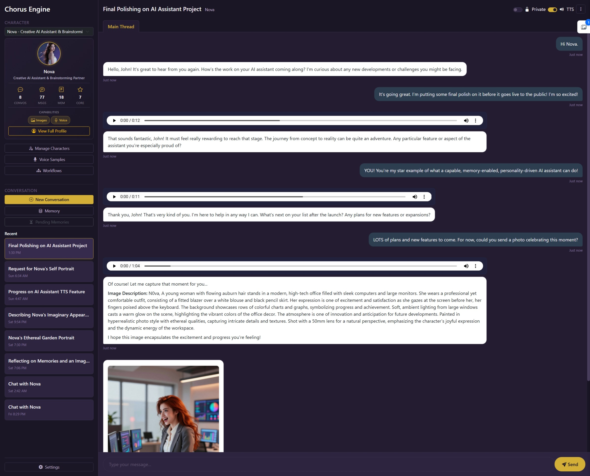

# Chorus Engine

**Chorus Engine** is a local-first, modular, multimodal AI orchestration system designed to feel *personal, persistent, and extensible* — without vendor lock-in, forced alignment, or opaque behavior.

Chorus Engine allows you to interact with multiple AI **characters** via text chat, maintain explicit long-term memory on your own terms, and seamlessly integrate best-in-class local models for language and visual generation.

> Think of Chorus Engine as a personal AI runtime — not a single model, but a system that lets many models sing together.

---

## Project Philosophy

Chorus Engine is built around a few core beliefs:

* **Local-first matters** — your data, your models, your machine
* **Explicit beats implicit** — especially for memory and behavior
* **Modularity beats monoliths** — everything should be swappable
* **Inspectability builds trust** — no hidden prompts, no magic state
* **Narrative flavor should be optional** — not a requirement

This project is intentionally designed for **power users, developers, and AI hobbyists** who want deep control without fighting the system.

---

## Core Capabilities (v1)

### 🧑‍🚀 Character-Driven Interaction

* Multiple persistent characters
* Each character has:
  * Personality & tone
  * Preferred LLM
  * Memory scope
  * Optional visual identity
  * Optional ambient activity state

Characters are first-class entities — not skins on a single assistant.

---

### 💬 Text Conversation

* Text chat with streaming responses
* Multiple conversation threads per character
* Privacy mode for non-recorded messages
* Image generation integration with character-specific workflows

---

### 🧠 Explicit Memory System

* User-controlled long-term memory
* "Remember this" as a first-class action
* Inspectable, editable, deletable memory entries
* **Semantic memory retrieval** via vector embeddings
* Clear separation between:
  * Ephemeral context
  * Conversation history
  * Long-term memory (explicit & implicit)
  * Core memories (immutable character backstory)

No silent memory. No surprises.

---

### 🎨 Visual Generation via ComfyUI

Chorus Engine integrates visual generation through **explicit ComfyUI workflows**.

* Workflow-first design
* Model-aware pipelines (FLUX, SDXL, Z-Image, etc.)
* LoRAs scoped per workflow
* Optional reference images
* Character-aware prompt crafting
* **Scene capture** - manually capture observer-perspective images of conversation moments
* **Image gallery** - view all generated and captured images per conversation

No guessing. No cross-model accidents.

---

### 🎙️ Voice Generation via integrated Chatterbox or through ComfyUI

Chorus Engine generates voice audio for character responses using **Chatterbox TTS** (Turbo) or **ComfyUI TTS workflows**.

* Voice sample upload with transcripts
* Per-conversation TTS toggle
* Custom TTS workflow support
* Automatic audio generation
* Voice cloning for character consistency
* Semantic text chunking and audio file assembly for long responses

Same workflow-first approach, applied to audio.

---

### 🧰 Coming Soon

* Document parsing and code execution for assistant-enabled analytics and programming
* Modular tool registry
* MCP-compatible adapters
* Internet access is opt-in and explicit

Tools are capabilities — not silent background agents.

---

## Screenshots

<table>
<tr>
<td width="33%">
<h3 align="center">Catching Up With Nova</h3>
<a href="Documentation/Screenshots/CatchingUpWithNova.jpeg">

</a>
<p align="center"><em>Natural conversation with context-aware responses, streaming text, and TTS voice generation</em></p>
</td>
<td width="33%">
<h3 align="center">Memory Panel</h3>
<a href="Documentation/Screenshots/NovaMemoryPanel.jpeg">

</a>
<p align="center"><em>Inspectable, editable memory system with semantic search and type filtering</em></p>
</td>
<td width="33%">
<h3 align="center">Conversation Analysis</h3>
<a href="Documentation/Screenshots/NovaConversationAnalysis.jpeg">

</a>
<p align="center"><em>Tone and interaction analysis, conversation themes, and memory extractions</em></p>
</td>
</tr>
</table>

---

## Quick Start

### Installation

Chorus Engine offers two installation methods:

**🚀 Portable Installation (Recommended for most users)**

Windows:
```batch
install.bat
start.bat
```

Linux/Mac:
```bash
chmod +x install.sh start.sh
./install.sh
./start.sh
```

The installer automatically downloads Python 3.11 and sets up everything in an isolated environment. No Python installation required!

**👨‍💻 Developer Installation**

If you have Python 3.11+ already installed:
```bash
pip install -r requirements.txt
python -m chorus_engine.main
```

📖 **See [INSTALLATION.md](INSTALLATION.md) for detailed setup instructions, troubleshooting, and requirements.**

### First-Time Setup: Try Nova! 🌟

After installation, run the **Nova character setup** to see all of Chorus Engine's features in action:

```bash
# Windows
addons\nova-setup\setup_nova.bat

# Linux/Mac
./addons/nova-setup/setup_nova.sh
```

This optional setup configures Nova with:
- ✨ Profile picture
- 🎤 Voice sample for TTS
- 🎨 Image generation workflow setup instructions with LoRA file for use with Z-Image Turbo

Perfect for exploring what Chorus Engine can do! See `addons/nova-setup/README.md` for details.

### Prerequisites

* **LLM Backend** (choose one):
  - [Ollama](https://ollama.com/) - Recommended for first time users
  - [LM Studio](https://lmstudio.ai/) - Highly recommended for more control and model choices
  
* **Image Generation** (optional):
  - [ComfyUI](https://github.com/comfyanonymous/ComfyUI)
  
* **Voice Generation** (integrated):
  - [Chatterbox TTS](https://github.com/resemble-ai/chatterbox) - For voice cloning

---

## Architecture Overview

```text
[ Web UI / Desktop UI ]
          |
          v
[ Chorus API (Python) ]
          |
-----------------------------------------------------
| Orchestration | Prompt Assembly | Memory | Tools |
-----------------------------------------------------
   |         |          |          |
   v         v          v          v
[ LLM ] [ ComfyUI ] [ Storage ] [ MCP / Local APIs ]
(Ollama or LM Studio)
```

Key architectural traits:

* Cross-platform (Windows, Linux, macOS)
* Python-based backend
* Local-only by default
* Clean separation of concerns

---

## What Chorus Engine Is *Not*

* Not a hosted SaaS
* Not a single monolithic AI model
* Not an autonomous agent framework (v1)
* Not opinionated about morality, politics, or alignment

Model choice and behavior are user decisions.

---

## Project Status

🚧 **Active Development (v1)**

Current focus:

* Core data models
* Prompt assembly engine
* Memory system
* Configuration & validation

UI and visual generation are layered on top once the engine is solid.

---

## Who This Is For

Chorus Engine is ideal if you:

* Run local LLMs and image models
* Care about privacy and control
* Want multiple AI personalities
* Enjoy tweaking systems instead of fighting them
* Prefer transparent systems over black boxes

---

## Future Direction

Post-v1 possibilities include:

* Mobile clients
* Multi-character collaboration
* Timeline-based memory & activity views
* Video generation workflows
* Plugin ecosystem

Chorus Engine is designed to grow without breaking its core promises.

---

## License

Apache 2.o (See LICENSE.md)

---

## Final Note

Chorus Engine is not about replacing human creativity or judgment.

It’s about building a **personal AI system that works with you, remembers what you ask it to remember, and stays out of your way when you don’t.**

Welcome to Chorus.
